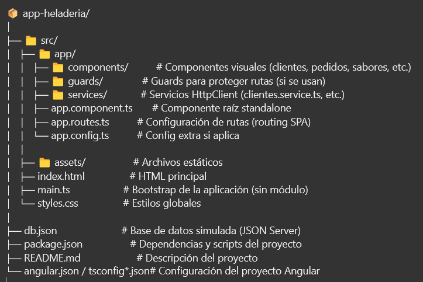

# Aplicación SPA CRUD en Angular 16

## Descripción del Proyecto

Este proyecto corresponde a la tarea final de Desarrollo Frontend, en la cual se desarrolló una **Single Page Application (SPA)** utilizando **Angular 16**. La aplicación implementa un sistema completo CRUD (Crear, Leer, Actualizar y Eliminar) que permite la gestión de datos a través de una interfaz amigable y funcional.

La aplicación demuestra la integración de las funcionalidades clave de Angular, como directivas estructurales, protección de rutas, comunicación con APIs y formularios reactivos, todo en un entorno SPA con routing configurado para una navegación fluida.

---
<div align="center">
  
</div>

---


## Tecnologías y Conceptos Aplicados

- **Angular 16**  
- **TypeScript**  
- **HTML5 & CSS3**  
- **Servicios HttpClient** para la comunicación con API REST  
- **Formularios Reactivos** para gestión avanzada de formularios y validaciones  
- **Routing y Guards** para protección y control de acceso a rutas  
- **Directivas Estructurales** como `*ngIf` y `*ngFor` para renderizado condicional y listado dinámico  
- **JSON Server** (o cualquier API simulada) para pruebas de backend local  

---

## Funcionalidades Principales

- **CRUD Completo**  
  - **Crear:** Añadir nuevas entidades mediante formularios reactivos.  
  - **Leer:** Listar datos consumidos desde la API con vistas detalladas.  
  - **Actualizar:** Modificar datos existentes y actualizar en el backend vía PUT.  
  - **Eliminar:** Borrar registros desde la interfaz con confirmación.  

- **Gestión de pedidos, clientes y sabores:**  
  Implementación práctica de un sistema de pedidos de helados, gestionando los datos de clientes, sabores y pedidos.

- **Protección de rutas con Guards:**  
  Uso de `CanActivate` para asegurar que sólo usuarios autorizados puedan acceder a ciertas vistas.

- **Validaciones y UX:**  
  Formularios con validación en tiempo real y mensajes de error, para asegurar una experiencia de usuario robusta y limpia.

---

## Estructura del Proyecto

<div align="center">
  
</div>

---

## Configuración y Ejecución!!!

1. **Clonar el repositorio:**  
   ```bash
   git clone https://github.com/Santiag0jaja/app-heladeria.git
   
   cd app-heladeria

2. **Instalar dependencias:**

   ```bash
    npm install

3. **Levantar API simulada (JSON Server):**

   ```bash
    npm install json-server
    json-server --watch db.json --port 3000

4. **Ejecutar la aplicación Angular:**

   ```bash
    ng serve
  Navegar a http://localhost:4200 para interactuar con la SPA.

---
**Notas Importantes**
La API simulada está configurada en http://localhost:3000 y los servicios Angular consumen esta dirección para realizar las operaciones CRUD.

Se ha implementado manejo básico de errores y confirmaciones para acciones destructivas como eliminar pedidos o clientes.

El proyecto está estructurado para facilitar la escalabilidad y el mantenimiento.

Créditos
---
Proyecto desarrollado por Santiago Díaz Echavarría como tarea final para la asignatura de Desarrollo Frontend.


